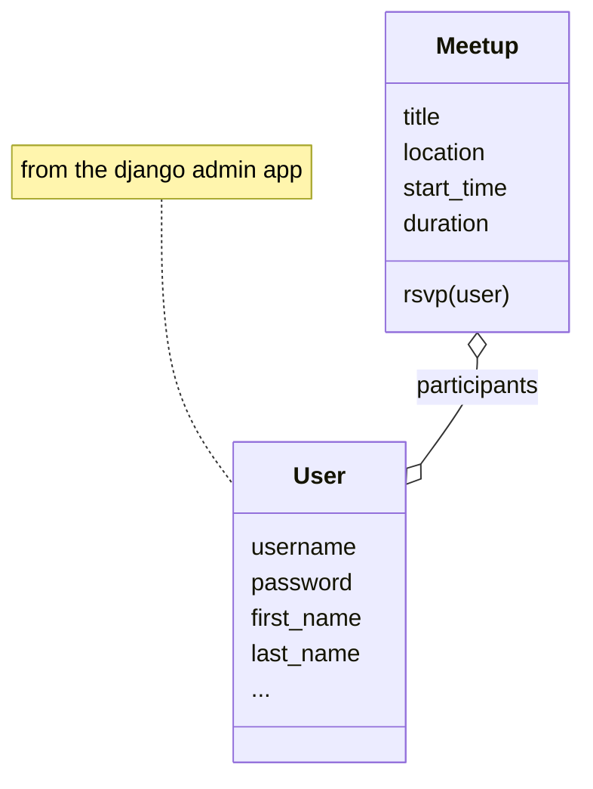

# This is a Django Scaffold App for Lab Exercises in [Info3](https://home.htw-berlin.de/~kleinen/info3/labs)

[Lab 10 SoSe 23](https://home.htw-berlin.de/~kleinen/classes/ss2023/info3/labs/lab-10-webapps-1/)

## Instructions

### Clone the repo
    git clone git@github.com:htw-imi-info3/django_lab_scaffold.git django_lab_studybuddy

    cd django_lab_studybuddy
    cd studybuddy_site

### Create a venv and install dependencies

You do not need to use a virtual environment - see [venv](https://docs.python.org/3/library/venv.html) - but you need to install the requirements and know in wich environment they are.

    virtualenv .venv_studybuddy
    source .venv_studybuddy/bin/activate

    pip install -r requirements.txt

### Prepare the Database: Migrate and Create Testdata

    python manage.py migrate

#### use fixture data:

    python manage.py loaddata studybuddy_app/fixtures/user.yaml
    python manage.py loaddata studybuddy_app/fixtures/meetup.yaml
    python manage.py runscript -v2 link_fixtures

the added superuser will be admin with password geheim12.
#### create data yourself:
or, start with adding a superuser and add data yourself using the admin app

    python manage.py createsuperuser

### Start the server 

    python manage.py runserver

You can check out (or use) the [Makefile](studybuddy_site/Makefile) for a bunch of useful commands.

## Model (so far)

https://mermaid.js.org/syntax/classDiagram.html

    
